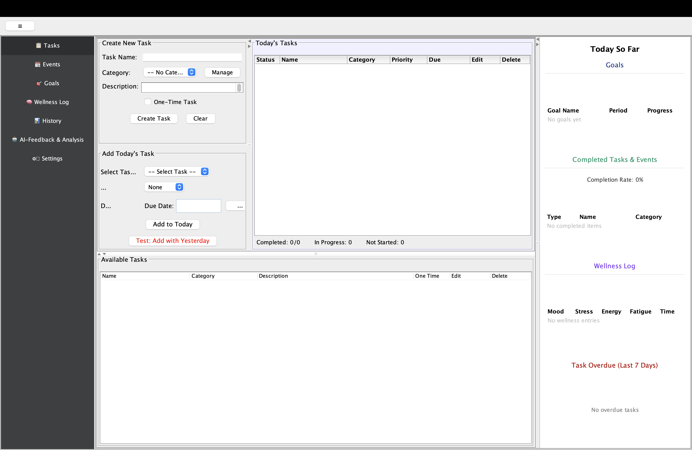
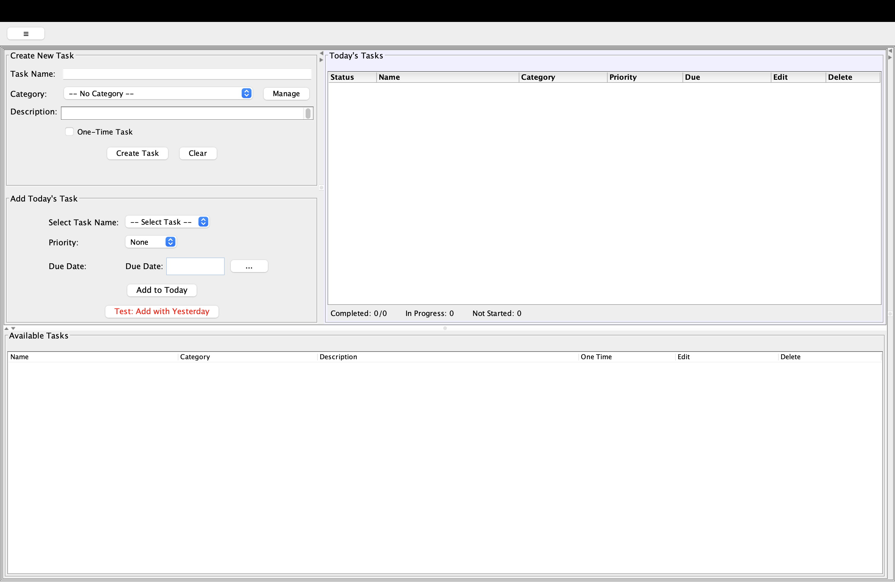
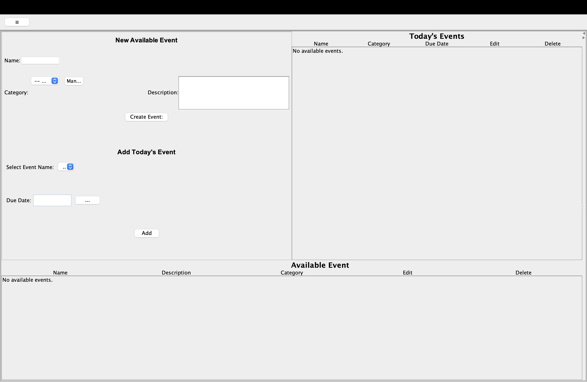
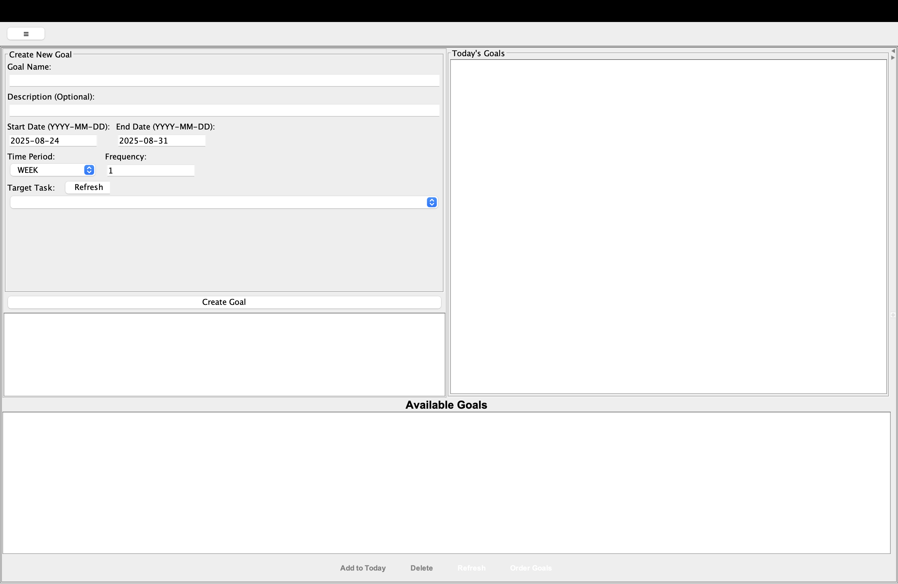
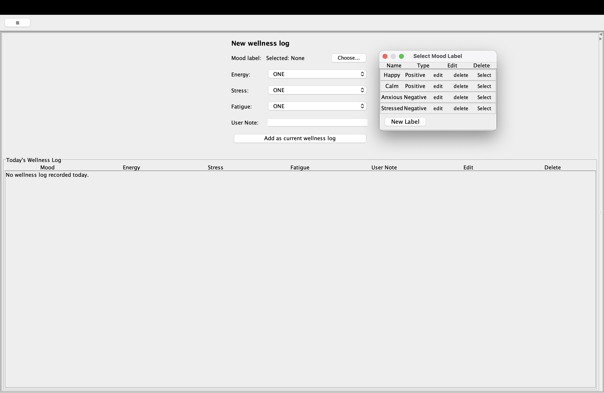
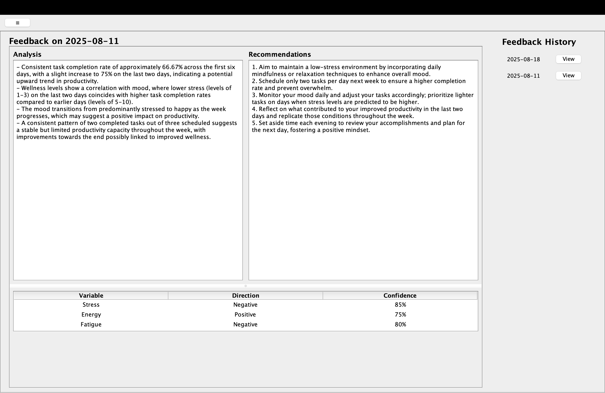
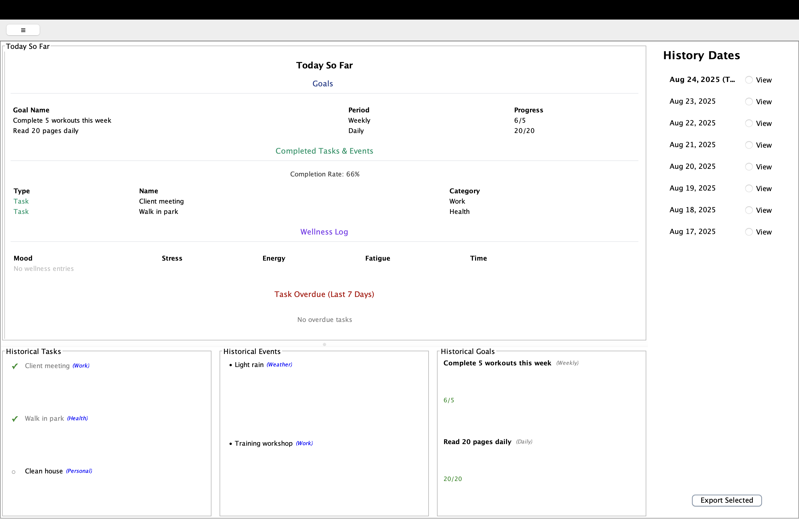
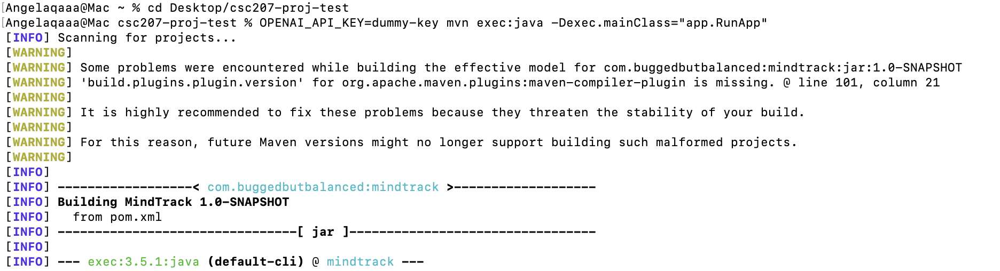

# **MindTrack**

*A comprehensive wellness tracking and productivity analytics application that helps users understand the relationship between their daily activities and mental wellbeing.*



---

## **Table of Contents**

1. [Authors and Contributors](#authors-and-contributors)
2. [Project Overview](#project-overview)
3. [Key Features](#key-features)
4. [Installation Instructions](#installation-instructions)
5. [Usage Guide](#usage-guide)
6. [API Integration](#api-integration)
7. [Known Issues and Troubleshooting](#known-issues-and-troubleshooting)
8. [Contributing](#contributing)
9. [Feedback](#feedback)
10. [License](#license)

---

## **Authors and Contributors**

**Team: Bugged but Balanced**

| Name | GitHub Username | Responsibilities                                                              |
|------|-----------------|-------------------------------------------------------------------------------|
| Angela (Qian) Su | @angelaqaaa     | Task management, category system, and history tracking                        |
| Alex/Qinyue Li | @lininnin       | Event tracking, wellness logging, mood management, and notification system    |
| Ina Wang | @iwa964 and @InaW2006 | AI feedback generation, correlation analysis, and data validation             |
| Sophia Lin | @phiaLXY28      | Goal setting and goal tracking                                 |

*This project was developed as part of CSC207 at the University of Toronto, implementing Clean Architecture principles and SOLID design patterns.*

---

## **Project Overview**

### **Purpose**
MindTrack is a mental wellness tracking application that correlates daily tasks, daily events, and goals with wellness metrics to help users understand the relationship between their activities, productivity, and mental wellbeing. Through AI-powered analysis, users can identify patterns and receive personalized recommendations for optimizing their wellness and productivity.

### **What Problem Does It Solve?**
Many people struggle to understand the connection between their daily activities and their mental wellness. MindTrack bridges this gap by:
- **Tracking daily tasks and events** alongside wellness metrics
- **Identifying patterns** between activities and mood, stress, energy levels
- **Providing AI-powered insights** for better decision-making
- **Offering personalized recommendations** for improved wellness and productivity

### **Tech Stack**
- **Frontend**: Java Swing GUI with Clean Architecture
- **Backend**: Java 11+ with Maven build management
- **Storage**: Local JSON file storage (no cloud sync)
- **AI Integration**: OpenAI GPT API for pattern analysis
- **Architecture**: Clean Architecture with SOLID principles

---

## **Key Features**

### **📋 Task Management**
- **Available → Today's Pattern**: Two-tier task system for flexible planning
- **Inline Editing**: Edit tasks directly in tables with Save/Cancel options  
- **Priority Management**: Set HIGH/MEDIUM/LOW priorities for today's tasks
- **Due Date Tracking**: Automatic daily recurrence for tasks with due dates
- **Overdue Detection**: Special panel for overdue tasks with 7-day history
- **One-time vs Regular Tasks**: Flexible task types for different use cases



### **📆 Event Tracking** 
- **Activity Logging**: Record events that impact wellness (weather, social interactions, etc.)
- **Correlation Analysis**: Events are analyzed for wellness impact during AI processing
- **Flexible Categorization**: Organize events by custom categories
- **Daily Recurrence**: Optional due dates for recurring events



### **🎯 Goal Setting & Progress Tracking**
- **Available → Current Goals**: Template goals that become active with specific targets
- **Period-based Tracking**: Weekly (7-day) or Monthly (30-day) goal periods
- **Automatic Progress Updates**: Goals update when linked tasks are completed
- **Today So Far Panel**: Real-time goal progress display (e.g., "Gym: 2/3 this week")



### **🧠 Wellness Logging**
- **Multi-dimensional Tracking**: Mood, stress (1-10), energy (1-10), fatigue (1-10)
- **Custom Mood Labels**: Create and categorize positive/negative mood states
- **Time-segmented Analysis**: Morning/afternoon/evening entries for detailed correlation
- **Reminder System**: 3 daily notifications (customizable times: 8 AM, 12 PM, 8 PM)



### **🤖 AI-Powered Analysis**
- **Automatic Weekly Reports**: Generated automatically every Monday at midnight EST with 7+ days of data
- **Manual Generation**: Users can also trigger analysis manually (limited to once per week)
- **Analysis Workflow**:
  1. **General Analysis**: Overall wellness and productivity analysis from weekly data
  2. **Bayesian Correlation**: Statistical correlation analysis between activities and outcomes
  3. **Personalized Recommendations**: AI-generated actionable advice based on patterns
- **Comprehensive Feedback**: Single integrated report combining all analysis types



### **📊 Data Visualization & History**
- **Today So Far Panel**: Real-time daily summary with overdue tasks, goals progress, completion rates, and wellness metrics
- **Historical Data**: Access to past daily logs and productivity trends via History page
- **Sortable Tables**: Click headers to sort task tables by name, category, priority, due date (limited columns)
- **Category Management**: Create, edit, and delete categories with cascade updates
- **Overdue Tasks Panel**: Special 7-day history panel showing overdue tasks



---

## **Installation Instructions**

### **Prerequisites**
- **Java 11 or higher** - [Download JDK](https://adoptium.net/) (JDK 11 minimum as per Maven configuration)
- **Maven 3.6+** - [Download Maven](https://maven.apache.org/download.cgi) for build management
- **Git** - [Download Git](https://git-scm.com/downloads) for version control
- **4GB RAM minimum** (8GB recommended for optimal performance)

### **System Compatibility**
- **Operating Systems**: Windows 10+, macOS 10.14+, Linux Ubuntu 18+
- **Architecture**: x64 systems (Intel/AMD 64-bit)
- **Network**: Internet connection required for AI analysis features

### **Step 1: Clone the Repository**
```bash
git clone https://github.com/lininnin/csc207-proj.git
cd csc207-proj
```

### **Step 2: Install Dependencies**
```bash
# Install all Maven dependencies
mvn clean install

# Skip tests during installation (optional)
mvn clean install -DskipTests
```

### **Step 3: Configure OpenAI API (Optional)**
For AI analysis features, set environment variable:
```bash
# Set OpenAI API key as environment variable
export OPENAI_API_KEY=your-openai-api-key-here

# Or set system property when running
mvn exec:java -Dexec.mainClass="app.RunApp" -DOPENAI_API_KEY=your-key

# Alternative: Set as JVM system property
OPENAI_API_KEY=your-key mvn exec:java -Dexec.mainClass="app.RunApp"
```

*Note: AI features will be disabled if no API key is provided. The application uses gpt-4o-mini model.*

### **Step 4: Build and Run**
```bash
# Compile the application
mvn compile

# Run the main application (recommended method)
mvn exec:java -Dexec.mainClass="app.RunApp"

# Alternative: If you experience font rendering issues, run through IDE
# Open src/main/java/app/RunApp.java in your IDE and run directly
```

### **Common Installation Issues**

**Java Version Conflicts**
```bash
# Check Java version
java -version
# Should show 11+ (17 recommended)

# Set JAVA_HOME if needed
export JAVA_HOME=/path/to/java11+
```

**Maven Build Failures**
```bash
# Clear Maven cache
mvn dependency:purge-local-repository

# Force update dependencies  
mvn clean install -U
```

**Font Rendering Issues**
```bash
# If you see garbled text or missing characters when running via Maven:
# 1. Try setting system properties
mvn exec:java -Dexec.mainClass="app.RunApp" -Dswing.defaultlaf=javax.swing.plaf.metal.MetalLookAndFeel

# 2. Alternative: Run directly from IDE (IntelliJ/Eclipse)
# This typically provides better font rendering

# 3. On Linux systems, install additional fonts
sudo apt-get install fonts-dejavu-core fonts-liberation
```


**Windows-Specific Issues**
- Ensure proper PATH environment variables
- Use `mvn.cmd` instead of `mvn` if needed
- Run command prompt as Administrator if permission issues occur

---

## **Usage Guide**

### **First Launch**
1. **Start the application** using one of the run methods above
2. **Navigate using the sidebar** - click any module button to switch views
3. **Create categories** before adding tasks/events
4. **Set up notifications** in Settings for wellness logging reminders

**Quick Start Example:**
```bash
# 1. Run the application
mvn exec:java -Dexec.mainClass="app.RunApp"

# 2. In the GUI:
# - Create categories: "Work", "Health", "Personal"
# - Add an available task: "Exercise" in "Health" category
# - Move it to today's list with HIGH priority
# - Log wellness entry with your current mood and stress level (1-10)
```


### **Basic Workflow**

#### **Task Management**
1. **Create Available Tasks**:
   ```
   Available Tasks Panel → Create Task → Enter name, description (optional), category (optional)
   ✓ Check "One-time" if task should not recur
   ```

2. **Add to Today's List**:
   ```  
   Today's Tasks Panel → Add Task → Select from dropdown → Set priority/due date (optional)
   ```

3. **Complete Tasks**:
   ```
   Today's Tasks Panel → Click checkbox → Task with ✓
   ```

#### **Wellness Logging**
1. **Add Wellness Entry**:
   ```
   Wellness Log Panel → Choose mood label, set stress(1-10), energy(1-10), fatigue(1-10)
   Add optional note → Save
   ```

2. **Create Custom Moods**:
   ```
   Choose Mood field → "New Label" → Select positive/negative type → Enter mood name 
   ```

#### **AI Analysis**
1. **Automatic Weekly Reports**:
   ```
   Reports generate automatically every Monday at midnight EST (requires 7+ days of data)
   View results: AI Feedback Panel → Latest comprehensive report
   Includes: General analysis + Bayesian correlations + Recommendations
   ```

2. **Review Historical Feedback**:
   ```
   Right side of AI Feedback Panel → Click date to browse past analyses and recommendations
   ```

### **Advanced Features**

#### **Goal Tracking**
```
1. Goals Panel → Create Goal → Set frequency (e.g., 3 times) + period (Weekly/Monthly) → Link to existing task
2. Available Goals → Add to Current   
3. Complete linked tasks → Goal progress updates automatically in "Today So Far" and "Current Goal"
```

#### **Data Export** 
```
History Panel → Select a date → Click Export
```

---

## **API Integration**

### **OpenAI GPT Integration**
MindTrack integrates with OpenAI's API for wellness pattern analysis:

#### **Configuration**
1. **Obtain API Key**: Register at [OpenAI Platform](https://platform.openai.com/)
2. **Set Environment Variable**: `export OPENAI_API_KEY=your-key`
3. **Set Usage Limits**: API calls limited to once per week per user

#### **Analysis Workflow**
1. **General Analysis**: Comprehensive wellness/productivity analysis of weekly data
2. **Bayesian Correlation**: Statistical analysis identifying significant correlations
3. **Recommendations**: AI-generated actionable advice based on discovered patterns

---

## **Known Issues and Troubleshooting**

### **Common Issues**

#### **Application Won't Start**
**Problem**: Java version conflicts or missing dependencies
```bash
# Solution 1: Verify Java version
java -version
# Should show 11+ (17 recommended)

# Solution 2: Clean and rebuild
mvn clean compile

# Solution 3: Check JAVA_HOME
echo $JAVA_HOME  # On Unix systems
echo %JAVA_HOME% # On Windows
```

---

## **Contributing**

### **How to Contribute**
While this is primarily an educational project, we welcome contributions that enhance learning:

#### **Types of Contributions**
- **Bug Fixes**: Resolve issues with existing functionality
- **Documentation**: Improve clarity of documentation and code comments
- **Testing**: Add test cases and improve coverage
- **Code Quality**: Refactoring for better SOLID compliance
- **Learning Resources**: Add examples and tutorials

#### **Contribution Guidelines**
1. **Fork the Repository**: Create your own copy
2. **Create Feature Branch**: 
   ```bash
   git checkout -b feature/improvement-description
   ```
3. **Follow Code Standards**: Maintain Clean Architecture principles
4. **Add Tests**: Ensure comprehensive test coverage
5. **Update Documentation**: Keep all docs current
6. **Submit Pull Request**: With clear description

#### **Code Review Process**
- **Automated Checks**: CI/CD pipeline runs tests and quality checks
- **Peer Review**: At least one team member reviews changes
- **Architecture Review**: Ensure Clean Architecture compliance
- **Documentation Review**: Verify documentation accuracy

#### **Development Environment Setup**
```bash
# Install development dependencies
mvn install

# Set up pre-commit hooks (optional)
# Configure IDE with project code style settings
# Enable automatic code formatting
```

---

## **Feedback**

We value your feedback to improve MindTrack and enhance the learning experience:

### **How to Provide Feedback**

#### **Bug Reports**
- **GitHub Issues**: [Create issue reports here](https://github.com/lininnin/csc207-proj/issues) with:
  - Steps to reproduce the problem
  - Expected vs actual behavior  
  - System information (OS, Java version)
  - Screenshots if applicable

#### **Feature Requests**
- **GitHub Discussions**: [Propose new features here](https://github.com/lininnin/csc207-proj/discussions) with:
  - Clear use case description
  - Benefits and justification
  - Implementation considerations
  - Alignment with Clean Architecture principles

#### **General Feedback**
- **Email**: Contact team members directly for course-related feedback
- **Peer Review**: Provide code review feedback on pull requests
- **Documentation**: Suggest improvements to README and documentation

### **Feedback Guidelines**
- **Be Specific**: Provide concrete examples and details
- **Be Constructive**: Focus on improvements and solutions
- **Be Educational**: Consider learning value for CSC207 objectives
- **Be Respectful**: Maintain professional and collaborative tone

### **Response Expectations**
- **Bug Reports**: Response within 3-5 business days
- **Feature Requests**: Evaluation within 1-2 weeks
- **Pull Requests**: Review within 1 week
- **General Questions**: Response within 2-3 business days

---

## **License**

This project is licensed under the MIT License - see the [LICENSE](LICENSE) file for details.

**Educational Project:** This software was developed as part of CSC207 coursework at the University of Toronto by Team Bugged but Balanced.

**Third-Party Dependencies:**
- All third-party libraries maintain their respective licenses
- See `pom.xml` for complete dependency list
- OpenAI API usage subject to OpenAI's terms of service
